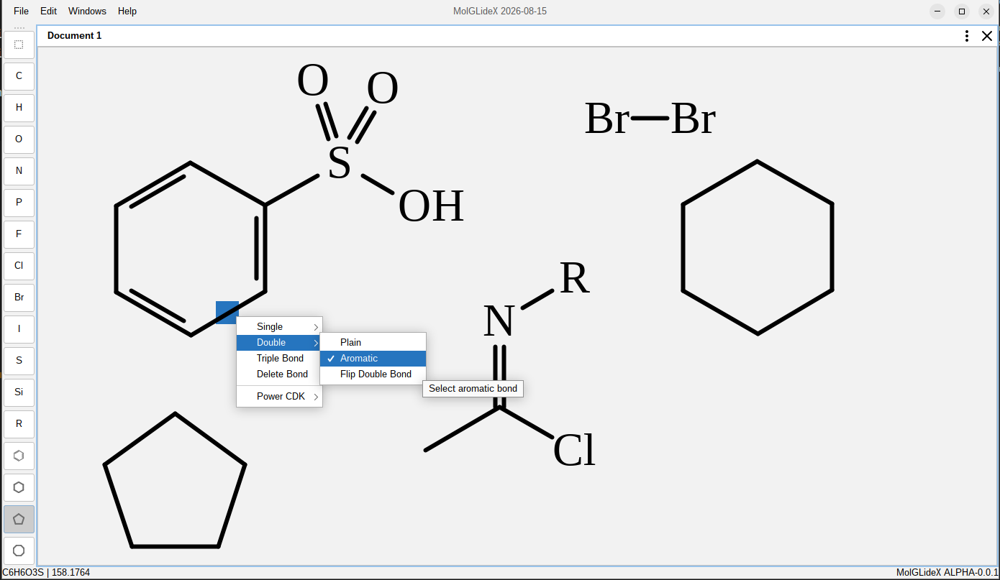

# MolGLideX 

MolGLideX is a continuation of [my previous project](https://github.com/JCox06/MolGLide) - Also called MolGLide.
This time, instead of writing overly complicated OpenGL graphics code to draw molecules, I am using Java's Graphics2D 
classes to render molecules and create the editor.

The application has all the features from before, and has a UI that is more fitting for a Desktop user-facing application 
which supports dark and light mode, and custom theming.

The application also no longer uses the standard JVM binary serializer, and instead saves application data in JSON format
wrapped inside a (.mgx) file.

Everything else aside, the application uses a very similar core to the original version.

## Features
- [x] Snappy and high-performance editor
- [x] Create basic and simplistic molecules
- [x] Create molecules from ring templates (mostly working, but see issues)
- [ ] Append/Fuse ring fragments to other molecules
- [x] Load and save your project as JSON text files (.mgx files)
- [x] Delete atoms, delete bonds, change element of already inserted atom
- [x] Undo, Redo support in the editor
- [x] Molecular formula and molecular weight calculation
- [ ] Exporting to other software
- [ ] Reaction Arrows, Curly Arrows, Custom text boxes
- [ ] Editing label of atom with custom text - like (Me, Et, CH2CH(OMe)CH3)

## Building
To build the project install maven or use an inbuilt version in your IDE
1) Install Java JDK (version 23+)
2) Download source code through git or web browser
3) In the source root directory run the following commands or import the project in your IDE
4) `mvn clean`
5) `mvn package`

## Technology Used
- Kotlin
- Java Swing
- [FlatLaf](https://www.formdev.com/flatlaf/)
- [Chemistry Development Kit](https://cdk.github.io/index.html)
- [JOML](https://github.com/JOML-CI/JOML)
- [Apache Batik](https://github.com/apache/xmlgraphics-batik)
- [Modern Docking](https://github.com/andrewauclair/ModernDocking)